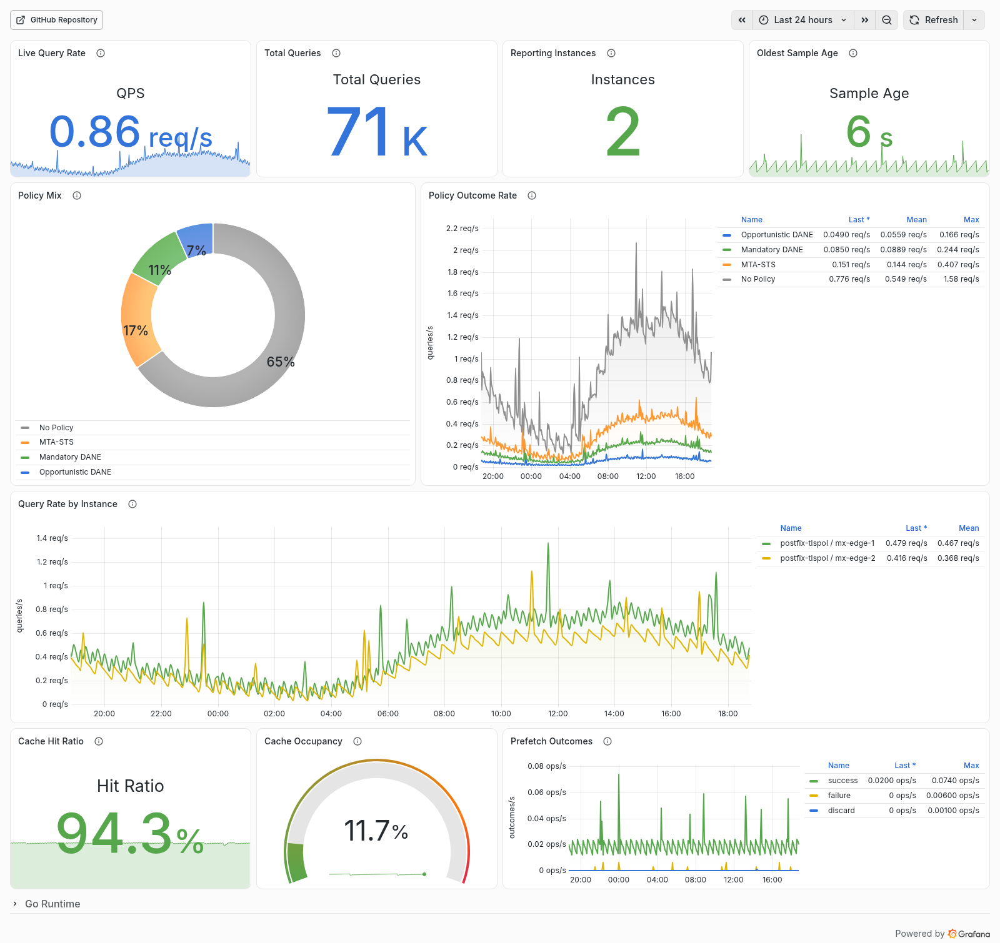

# postfix-tlspol

[](https://github.com/Zuplu/postfix-tlspol/releases/latest) [](https://github.com/Zuplu/postfix-tlspol/blob/main/LICENSE) [](https://github.com/Zuplu/postfix-tlspol/actions/workflows/github-code-scanning/codeql/) [](https://app.codacy.com/gh/Zuplu/postfix-tlspol/dashboard?utm_source=gh&utm_medium=referral&utm_content=&utm_campaign=Badge_grade) [](https://hub.docker.com/r/zuplu/postfix-tlspol/tags) [](https://github.com/Zuplu/postfix-tlspol/actions/workflows/dependabot/dependabot-updates)

[](#)

A lightweight and highly performant MTA-STS + DANE/TLSA resolver and TLS policy socketmap server for Postfix that complies with the applicable standards and prioritizes DANE where possible.

## New: Prometheus Metrics & Grafana Dashboard

[](assets/postfix-tlspol-dashboard.png)

The socketmap listener auto-detects HTTP and exposes `/metrics` on the same Unix/TCP socket. Metrics include Go runtime state, policy outcomes, cache hit/miss and occupancy data, and prefetch success/failure/discard counters. All metric labels use fixed value sets. You can also set `server.metrics-address` for a separate HTTP-only metrics endpoint that does not expose the socketmap protocol. The bundled dashboard is available at [`assets/grafana-postfix-tlspol-dashboard.json`](assets/grafana-postfix-tlspol-dashboard.json). The preview uses the reproducible [Grafana TestData demo](assets/demo/) rather than production telemetry.

Keep the socketmap listener bound to loopback or a protected Unix socket. Postfix policy queries are available on every configured listener, while the diagnostic and cache-management commands used by `-query`, `-dump`, `-export`, and `-purge` are accepted only from loopback or Unix-socket peers. For Docker deployments, run those administrative commands with `docker exec`.

# Logic

- Simultaneously checks for MTA-STS and DANE for a queried domain.

- **For DANE:**
  - Apply the authenticated implicit-MX rule when a DNSSEC-authenticated MX query returns NOERROR without MX records, while keeping NXDOMAIN and Null MX responses distinct, as required by [RFC 7672, Section 2.2.2](https://www.rfc-editor.org/rfc/rfc7672.html#section-2.2.2).
  - Bound negative DNS cache lifetimes by the smaller SOA TTL and SOA MINIMUM value, following [RFC 2308, Section 5](https://www.rfc-editor.org/rfc/rfc2308.html#section-5).
  - Resolve each MX host's A/AAAA records before querying TLSA. Hosts without address records are unreachable, and only DNSSEC-authenticated address paths proceed to TLSA discovery, as required by [RFC 7672, Section 2.2.2](https://www.rfc-editor.org/rfc/rfc7672.html#section-2.2.2). Independent MX lookups run with bounded concurrency.
  - Verify TLSA records for correctness and supported parameters, only then the `dane-only` policy (Mandatory DANE) will be returned.
  - In case of unsupported parameters or malformed TLSA records, `dane` (Opportunistic DANE) is returned.
  - In those edge cases, Postfix will try to enforce DANE if the TLSA records are usable. If they are not (despite valid DNSSEC signatures, e. g. malformed record set by the legitimate domain administrator or unsupported parameters), it will fall back to *mandatory* but unauthenticated TLS (thus `encrypt` at worst).
  - If the TLSA records are usable but invalid (e. g. key fingerprint mismatch), the mail will be deferred (for both `dane` and `dane-only`), even if there is a valid MTA-STS policy (in conformance with [RFC 8461, 2](https://www.rfc-editor.org/rfc/rfc8461#section-2)).

- **For MTA-STS:**
  - Check for an existing MTA-STS record over DNS, and if found, fetch the policy via HTTPS.
  - DANE is authoritative when fresh and usable. MTA-STS is only used when fresh DANE state explicitly proves that no DANE policy is available.
  - Temporary DANE failures do not downgrade to MTA-STS. TLSA records must be explicitly and verifiably not available for MTA-STS to overrule DANE.
  - MTA-STS and DANE state are cached independently, so a later refreshed DANE result immediately overrides a still-fresh MTA-STS policy.
  - A temporary or unavailable policy refresh does not erase an unexpired cached MTA-STS policy. A successfully fetched `mode: none` policy still replaces the cached policy immediately.
  - When fresh DANE state confirms that no applicable DANE policy is available for the domain, MTA-STS can take effect and return a `secure` policy with explicit `match=` constraints from the policy's MX patterns.

- DANE and MTA-STS branches are cached by `minimum TTL of all DNSSEC/DANE queries` and for no longer than the MTA-STS `max_age`, respectively. The served result is derived from the fresh branch state on every cache hit, with mandatory DANE (`dane-only`) taking precedence.

It is recommended to still set the default TLS policy to `dane` (Opportunistic DANE) in Postfix (see below).

# Install packaged version

List of repositories serving prebuilt and packaged versions of postfix-tlspol:

[](#)

# Install via Docker

Installation with Docker simplifies setup, as it contains its own properly configured DNS resolver, `Unbound`. The image itself is only about 8 MB (compressed).

```sh
docker volume create postfix-tlspol-data
docker volume create postfix-tlspol-unbound
docker run -d \
    -v postfix-tlspol-data:/data \
    -v postfix-tlspol-unbound:/var/lib/unbound \
    -p 127.0.0.1:8642:8642 \
    --read-only \
    --cap-drop ALL \
    --security-opt no-new-privileges \
    --pids-limit 256 \
    --tmpfs /tmp:rw,noexec,nosuid,nodev,size=16m \
    --stop-timeout 30 \
    --restart unless-stopped \
    --name postfix-tlspol \
    zuplu/postfix-tlspol:latest
```

Jump to *Postfix configuration* to integrate the socketmap server.

To update the image, stop and remove the container, and run the `docker run ...` command again.

To disable prefetching, pass `-e TLSPOL_PREFETCH=0` to the above command.

The image health check verifies both the local validating resolver and the policy server. The entrypoint supervises both processes and exits if either one fails, allowing the restart policy to recover the complete service.

# Install from source

## Build a Docker container from source

```sh
git clone https://github.com/Zuplu/postfix-tlspol
cd postfix-tlspol
scripts/build.sh
```
Press _d_ for Docker when prompted or select it if a terminal UI appears.

## Standalone

### Requirements

These requirements only apply if you use the non-Docker variant for installation, i. e. as a systemd service unit.

- Postfix
- Go (latest)
- DNSSEC-validating DNS server (preferably on localhost)

### Build and install

```sh
git clone https://github.com/Zuplu/postfix-tlspol
cd postfix-tlspol
scripts/build.sh
```
Press _s_ for systemd when prompted or select it if a terminal UI appears.

Edit `/etc/postfix-tlspol/config.yaml` as needed. After any change, a restart is required:
```sh
service postfix-tlspol restart
```

# Postfix configuration

In `/etc/postfix/main.cf`:

### Before Postfix 3.10

```conf
smtp_dns_support_level = dnssec
smtp_tls_security_level = dane
smtp_tls_dane_insecure_mx_policy = dane
smtp_tls_policy_maps = socketmap:inet:127.0.0.1:8642:QUERY
```

<details>
  <summary><b>Explanation for <code>smtp_tls_dane_insecure_mx_policy</code></b></summary>

  This bug has been fixed in [Postfix stable release 3.10.0](https://www.postfix.org/announcements/postfix-3.10.0.html), as well as in [Postfix legacy releases 3.9.2, 3.8.8, 3.7.13, and 3.6.17](https://www.postfix.org/announcements/postfix-3.9.2.html) and all subsequent newer releases. *You do not need to manually set this, if you use one of these or more recent versions.*

  Explicitly setting <code>smtp_tls_dane_insecure_mx_policy</code> to <code>dane</code> is a workaround for a bug that only matters in case you change the recommended default <code>smtp_tls_security_level</code> to something different than <code>dane</code>.

  postfix-tlspol returns <code>dane</code> (opportunistic DANE) only for domains where <code>dane-only</code> (mandatory DANE) is not possible (because the MX lookup is unsigned, but the MX server itself supports DANE). Not setting this would render <code>dane</code> ineffective and only honor <code>dane-only</code>, if your <code>smtp_tls_security_level</code> is not <code>dane</code>. So even when postfix-tlspol explicitly requests opportunistic DANE for a domain, Postfix would ignore it before the fix.
</details>

### For Postfix 3.10 and later

```conf
smtp_dns_support_level = dnssec
smtp_tls_security_level = dane
smtp_tls_policy_maps = socketmap:inet:127.0.0.1:8642:QUERYwithTLSRPT
```

Note the `QUERYwithTLSRPT` that enables TLSRPT support for Postfix 3.10+.

### Reload

After changing the Postfix configuration, do:
```sh
postfix reload
```

# Update (from source)

You can update postfix-tlspol (both the Docker container and the systemd service variant), by simply doing:
```sh
git pull
scripts/build.sh
```

# Configuration

_*Warning:* Configuring is only available for the standalone/systemd installation. The Docker version is autoconfigured._

Configuration example for `/etc/postfix-tlspol/config.yaml`:
```yaml
server:
  # server:port to listen as a socketmap server
  # or unix:/run/postfix-tlspol/tlspol.sock for Unix Domain Socket
  # may be empty when systemd socket activation supplies all listeners
  # when set with socket activation, it should match one ListenStream address
  address: 127.0.0.1:8642

  # optional HTTP-only metrics endpoint, e.g. 127.0.0.1:9642
  # or unix:/run/postfix-tlspol/metrics.sock
  # unset by default because /metrics is also autodetected on the socketmap listener
  #metrics-address:

  # socket file permissions if Unix Domain Sockets are used
  socket-permissions: 0666

  # prefetch when TTL is about to expire (default true)
  prefetch: true

  # cache file (default /var/lib/postfix-tlspol/cache.db)
  # in-memory entries are bounded to 50,000 and pruned to 45,000 in batches
  cache-file: /var/lib/postfix-tlspol/cache.db

dns:
  # must support DNSSEC, uses /etc/resolv.conf if unset
  #address: 127.0.0.53:53
```

Configuration loading is strict and capped at 1 MiB: unknown YAML fields, invalid log levels or formats, malformed listener/resolver addresses, unsupported socket permission bits, and empty cache paths stop startup with an error. `TLSPOL_PREFETCH` and `TLSPOL_TLSRPT` accept only `0` or `1`; malformed values also stop startup.

The persisted cache is written through a temporary file and atomically renamed. Corrupt or truncated snapshots are rejected and repaired with a valid empty snapshot, while purge and final-shutdown persistence failures are surfaced as errors.

# Prefetching

Prefetching is enabled by default, and postfix-tlspol tries to keep its cache fresh. Refresh failures use bounded retries and preserve still-valid branch state. The in-memory cache is capped at 50,000 entries and pruned to 45,000 entries in one batch, favoring useful and frequently accessed policies.

# Tests

The default test suite uses deterministic local fixtures. Tests that query public DNS and HTTPS services are opt-in:

```sh
TLSPOL_LIVE_TESTS=1 go test ./internal
```
